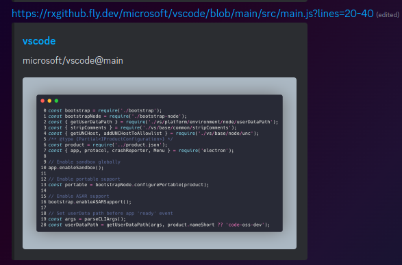

# rx_github (RxGitHub)
A simple Rust web app that allows you create nice embeds for your GitHub code.



### Usage
Simply replace `github.com` with `rxgithub.com` when you're sending a GitHub code plob webpage.

Or

Install this JS bookmarklet ([source](/bookmarklet.js))
You can install it by highlighting the contents of the above code block, and then dragging it to your bookmark toolbar.
```html
javascript:(function()%7Bconst%20githubUrl%20%3D%20%22https%3A%2F%2Fgithub.com%22%3B%0Aif%20(window.location.href.startsWith(githubUrl))%20%7B%0A%20%20%20%20const%20rxGithubUrl%20%3D%20%22https%3A%2F%2Frxgithub.com%22%20%2B%20window.location.href.substring(githubUrl.length)%3B%0A%20%20%20%20navigator.clipboard.writeText(rxGithubUrl)%3B%0A%7D%7D)()%3B
```
Clicking on the bookmarklet will copy the RxGitHub embed URL to your clipboard, then you can send it to Discord, Twitter, etc. 
